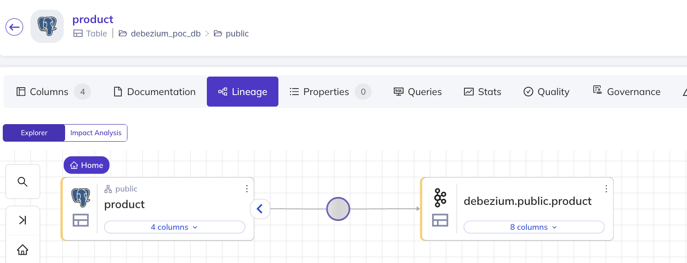

# Debezium - Openlineage - DataHub POC

## What's in this repository?

This is a POC integration of Debezium and DataHub using OpenLineage. The goal is to demonstrate how you can emit 
OpenLineage events from Debezium postgres connector, consume them in DataHub and visualize the Lineage Graph.

## Components & logic

- Postgres database
- Java application that publishes a record to `product` table every 
- Debezium postgres connector that publishes change events to Kafka. The connector emits OpenLineage events
- DataHub that consumes the OpenLineage events

This is the expected graph:



## How to build it?
### Foreword
Currently published version isnt't easy to run. When building it, I've found 3 bugs and this repo contains fixes, that
aren't released yet. Here are the bugs:

- https://github.com/datahub-project/datahub/issues/13854
- https://github.com/datahub-project/datahub/issues/13874
- https://issues.redhat.com/browse/DBZ-9192

The Debezium fix is already merged to main, so I'm using `nightly` docker image. It's not stable, but the fix is there.

Datahub is built from the following PR that isn't merged yet:

https://github.com/datahub-project/datahub/pull/13347/files

So in order to run it, you'll need to have a docker image that contains changes in this pr. I've built it locally with
the tag `debug`. I'll update this repo once the fix is released.

Another hurdle is the build process of the openlineage-java library. I've built the jar locally with some custom tweaks
, but here's the debezium documentation that describes a different approach:

https://github.com/debezium/debezium/pull/6502/files

### Okay, but what steps do I need to take once I have the images?
#### Prerequisites:
- Docker
- Java

1. Build DataHub Docker images for a version that contains the changes. Once it's released it will be easy, until 
that - check out the DataHub repo on a commit that contains the changes, build all images and tag them as `debug`.

2. Start all Docker Containers:
```bash
   docker-compose up -d
```
   
3. Start the Java application that inserts records into the Postgres database
```bash
   cd java-db-producer
   ./gradlew bootRun
```

4. Register the Debezium connector. Initial configuration doesn't publish OpenLineage events, it just logs them to the 
console. This is done so that the connector creates the kafka topic. 
```bash
   cd debezium
   ./register-connector.sh
```

5. Check in the Kafka UI that the topic has been created. Kafka UI is at http://localhost:8090. 
Topic name is `debezium.public.product`.

6. Open DataHub and ingest metadata from Postgres and Kafka.
   - Open DataHub UI at http://localhost:9002. Credentials are `datahub/datahub`.
   - Click the Data Sources button on the left. If it's not there (happened a few times to me), waiting a bit and/or 
recreating the `datahub-gms` and `datahub-frontend-react` helped.
   - You'll be creating thew new data sources:
     - Kafka: 
       - Bootstrap Servers: `kafka:9094`
       - Schema Registry URL: `http://schema-registry:8081`
       - Name: `Kafka or whatever you want`
     - Postgres:
       - Host and Port: `postgres:5432`
       - Username: `postgres`
       - Password: `postgres`
       - Database: `debezium_poc_db`
       - Name: `Postgres or whatever you want`

7. After you've done that, validate that the ingestion process has finished. 
On the top of DataHub UI there is a searach bar. Right of it is the "View all" button. After clicking it, you should see
12 Kafka objects and 3 Postgres objects. 

8. Now you can re-run the Debezium connector with OpenLineage integration over http. But we'll stop it first.
```bash
  ./debezium/delete-connector.sh 
```

9. Edit the `openlineage.yml` configuration file. Comment the `type: console` line and uncomment the `type: http`
 line. This will make the new container emit OpenLineage events over http to DataHub (actually to the http proxy, 
but then to DataHub).

9. Delete the Debezium container and recreate it, so that it picks up the new configuration.
```bash
  docker compose down debezium --volumes
  docker compose up -d debezium
```

10. Register the connector again, this time it will emit OpenLineage events.
```bash
  cd debezium
  ./register-connector.sh
```

11. Open DataHub UI and click `View all` again. You should see 2 new objects in the `debezium` namespace. 
The `Task` named `0` should have a `Lineage` tab. Once you click it, you should see the lineage graph - the same 
that you've seen at the beginning of this readme.